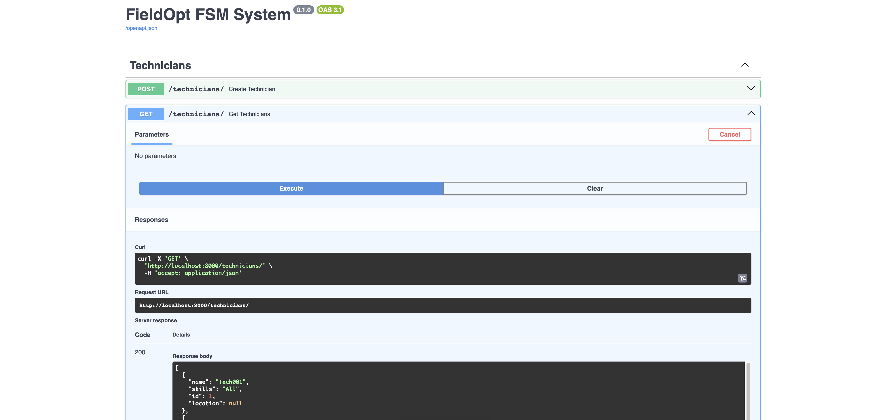

# FieldOpt
[v0.0.2]




## Overview
An open-source field service management (FSM) system built using FastAPI and SQLite. It lets you create technicians and jobs, auto-assign work based on skills, and manage job state transitions using FSM-style logic (pending → assigned → in progress → completed).

---

## Change Log
[v0.0.2]

- FastAPI + React integration; it isn't pretty but it's scaffolded
- Technician + Job CRUD via API
- Live frontend displaying job/tech tables; based on created jobs/techs

---

## Usage

### Backend

#### Clone the repo
```bash
git clone https://github.com/zblauser/fieldopt.git
cd fieldopt
```

#### Set up a virtual environment
```bash
python3 -m venv venv
```
```bash
source venv/bin/activate <-- mac/linux
venv\Scripts\activate <-- on windows
```

#### Install dependencies
```bash
pip install fastapi uvicorn sqlalchemy pydantic
```

#### Run the app
```bash
uvicorn app.main:app --reload
```

#### Open Swagger UI
```
http://localhost:8000/docs
```

#### While running:

- Create technicians with skills and locations
- Create service jobs with required skills and customer info
- Auto-assign jobs to matching technicians
- FSM job lifecycle: `pending → assigned → in_progress → completed`
- Interactive API testing via Swagger UI

### Frontend
```bash
cd fieldopt/frontend
```

#### Install Dependencies
```bash
npm install
```

#### Start React Server
```bash
npm run dev
```

#### Open Frontend UI
```bash
http://localhost:5173
```

### Notes

- Built with Vite + Tailwind CSS
- Requires FastAPI backend running at http://localhost:8000

---

#### API Endpoints

##### Technicians
- `POST /technicians/`
- `GET /technicians/`

##### Jobs
- `POST /jobs/`
- `GET /jobs/`
- `POST /jobs/{job_id}/assign`
- `PATCH /jobs/{job_id}/start`
- `PATCH /jobs/{job_id}/complete`

---

## Current Timeline

- Backend
	- job cancellation						[ ]
	- job reassignment						[ ]
	- manual job assignment					[ ]
	- tech coordinates (automatic/manual)	[ ]
	- permissions							[ ]

- React Frontend
	- drag/drop interface					[ ]
	- map interface							[ ]
	- cleaner interface						[ ]

- Mobile GUI
	- tech endpoint							[ ]
	- mobile job/tech manager				[ ]
 
---

## Contributing

If you share the belief that simplicity empowers creativity, feel free to contribute. 

#### Contribution is welcome in the form of:              
- Forking this repo                                       
- Submiting a Pull Request                                
- Bug reports and feature requests                        
                                                          
Please ensure your code follows the existing style.  

---

## Thank you for your attention.                          
If you hit any issues, feel free to open an issue on GitHub.                                                        
Pull requests, suggestions, or even thoughtful discussions are welcome.
